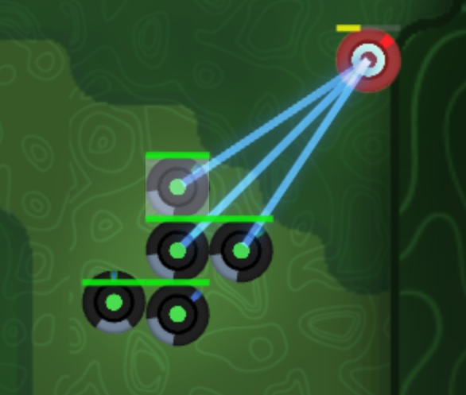

# Health visualizer for Screeps:Arena
Visualize creeps' health via health bar. Only a lightweight file.
爬爬血量可视化模块。

## Usage
Import the file and call the function for a creep.
```javascript
import { Creep } from "game/prototypes";
import { getObjectsByPrototype } from "game/utils";
import { showHealthBar } from "<path-to-this>/healthVisualizer.mjs";
export function loop() {
    getObjectsByPrototype(Creep).forEach(creep => showHealthBar(creep););
}
```



In fact, it's capable for all objects containing property `x`, `y`, `hits`, and `hitsMax`. You can apply `StructureTower` to it too.

## Contribution
Any contribution is welcome.
计划加入更多绘制选项。
